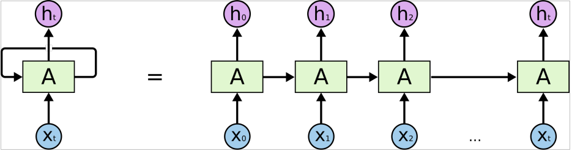
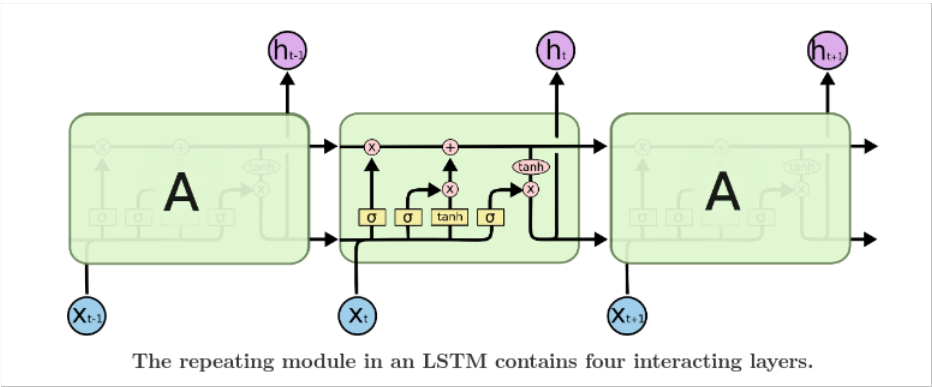
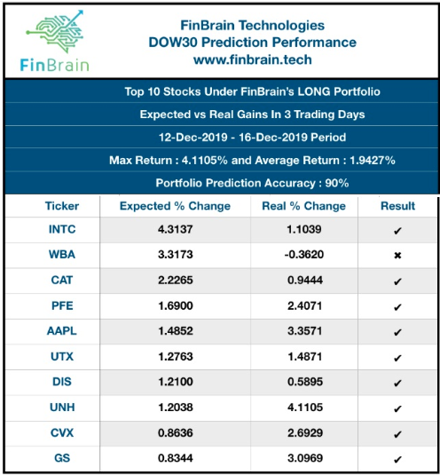
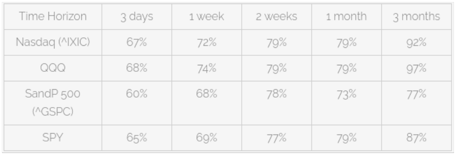

# An Interesting transition driven by AI
Author: Rishabh Agrawal

AI and machine learning is taking over the world. It has gotten his hands into Cloud computing, space and energy, banking, medicine, transport, commerce, and its rapidly spreading in other fields as well. AI can be practically used in every field in some or the other manner. One of these fields that is really interesting is the field of time series prediction of the stock market. I think it’s really interesting to see how a computer AI can predict something as volatile as a stock price. 

The uses of stock level prediction are very vast. The most obvious one being, making some money and betting your money as per the prediction after you are pretty convinced by it. The second one, which is probably not that direct is to use it to see when the market can really take a toll in the country as per previous years. Every country has their market crashes and booms almost recurring every few years. With this AI prediction, it is going to be much easier to realize when that is going to happen for a pircticular country or a huge company. Since these AI predictions can get accurate for long term prediction more the short term, the second use case seems more useful and accurate, however you can also invest in the market for the long term gains which will also be valuable. 

Stock market prediction is a relatively new concept but is coming in really hot in the year 2021. This is mainly because of COVID-19 which has caused a lot of people to start a side hustle such as entering in stocks and other businesses. This year a lot of new people have entered the stock market through online  stock brokers such as (Robinhood, WeBull, etc). In fact Robinhood increased 13 million users in 2020. 

Currently stocks can be predicted using Recurrent Neural Network – Long Short-Term Memory. LSTM is also used for other time series forecasting such as weather and climate. It is an area of deep learning that works on considering the last few instances of the time series instead of the entire time series as a whole. A recurrent neural network can be thought of as multiple copies of the same network, each passing a message to a successor. 

This chain-like nature reveals that recurrent neural networks are intimately related to sequences and lists. They’re the natural architecture of neural network to use for such data. LSTMs are explicitly designed to avoid the long-term dependency problem. Remembering information for long periods of time is practically their default behavior, not something they struggle to learn.

FinBrain Stock Forecasting Technology

FinBrain Technologies is the service most traders are interested in. IT offers Artificial Intelligence enabled financial prediction technologies. They serve stock, commodities, forex and cryptocurrency markets.

They use models that learn using artificial neural networks, advanced deep learning algorithms, non-linear data, analyze historic data, deploying self-learning and self-adapting algorithms, study market sentiment factors, and technical indicators to forecast prices.

I Know First

I Know Firstclaims in a report that it achieved 97% accuracy in its AI based predictions of the SandP 500 (^GSPC) and Nasdaq (^IXIC) indices, as well as their respective ETFs (SPY and QQQ).

The company said that during 2019, its ETF tracking of the S&P 500 was 87% accurate of the time for the 3-month prediction time horizon. They claim they can predict the 3-day time horizon at 65%, 7-day time horizon at 69%, and 14-day time horizon at 79%. They offer online artificial intelligence stock trading accounts starting at $169 per month to $349 per month. At that very low price, it seems worth a try. Check them out here:I Know First.

So we can see how the stock prediction works and how it is now increasing on a really rapid rate. 

References: 
http://ai-marketers.com/ai-stock-market-forecast/
https://colah.github.io/posts/2015-08-Understanding-LSTMs/
